<!-- Generated by scripts/build.ts — run `pnpm readme` to regenerate. Edit the generator, not this file. -->

# GeneralD Themes

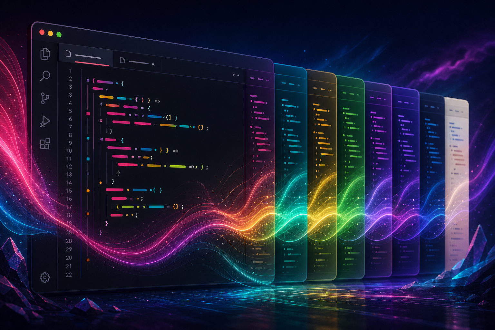

A collection of custom VSCode themes by GeneralD

## Themes

### Akihabara

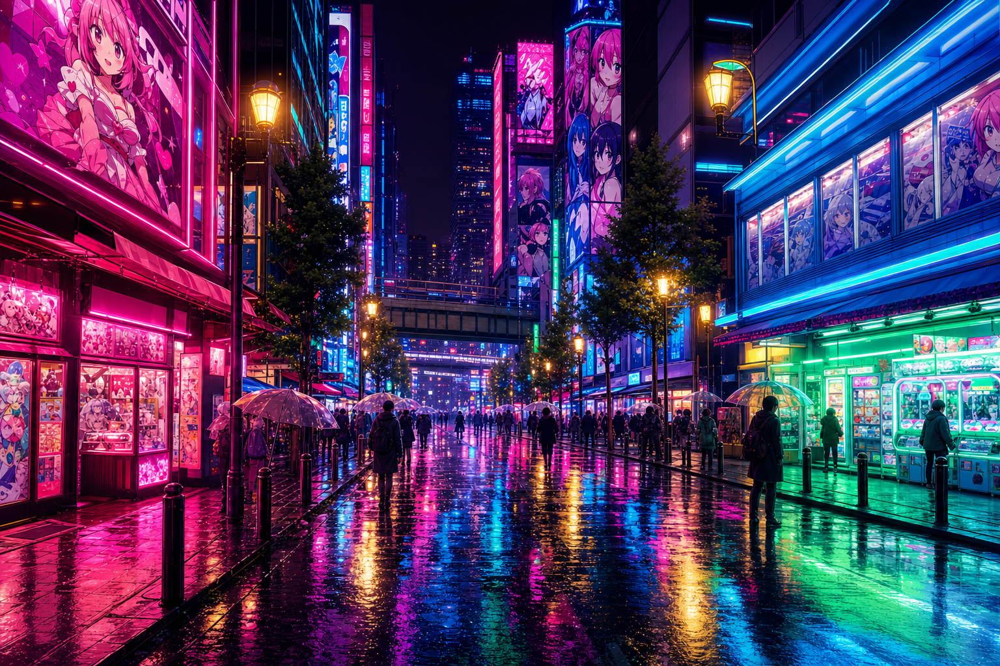

> A vivid neon dark theme inspired by Tokyo's Akihabara Electric Town. Anime pink signs, LED blue storefronts, arcade green glow, and golden lamplight pulse through the midnight backstreets.

**Type:** dark | **Palette:**     

### Arknights

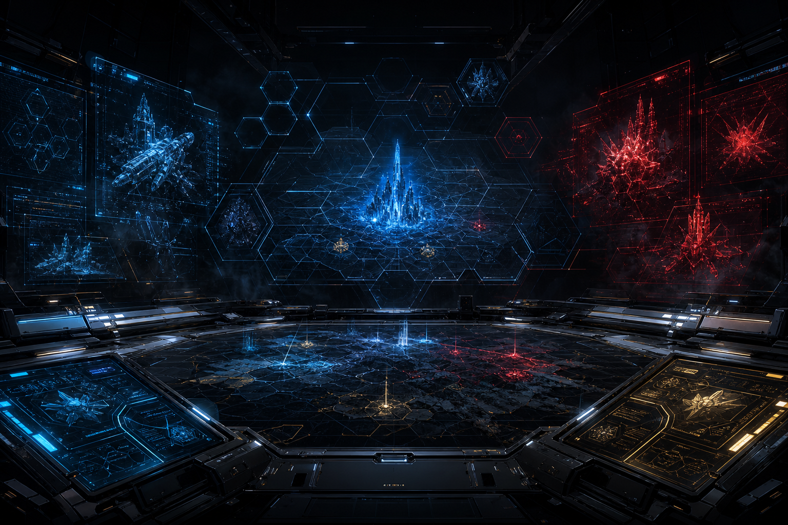

> A sleek dark theme inspired by the tactical RPG Arknights. Rhodes Island's cold, clinical interface meets Originium blue, operator gold, and crisis red across a battle-hardened terminal.

**Type:** dark | **Palette:**     

### Cyberpunk Neon

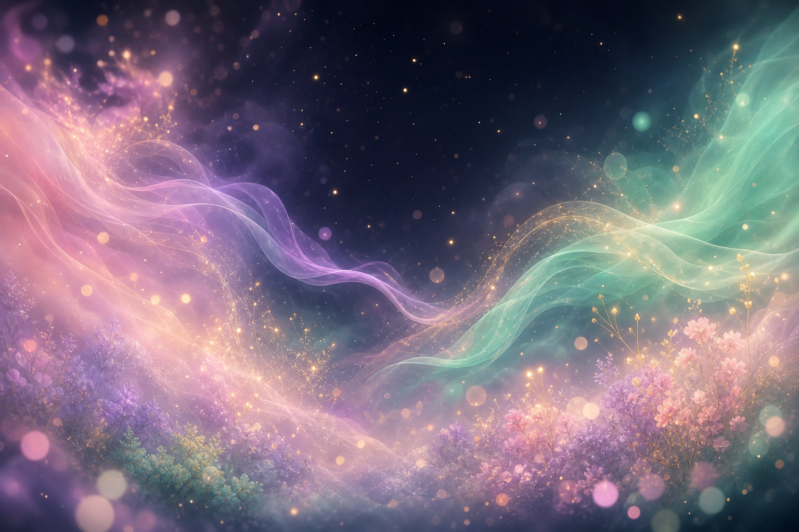

> A neon-drenched dark theme inspired by cyberpunk aesthetics. Vivid pinks, electric cyans, and deep purples glow against the void of a digital underworld.

**Type:** dark | **Palette:**     

### Deathcore

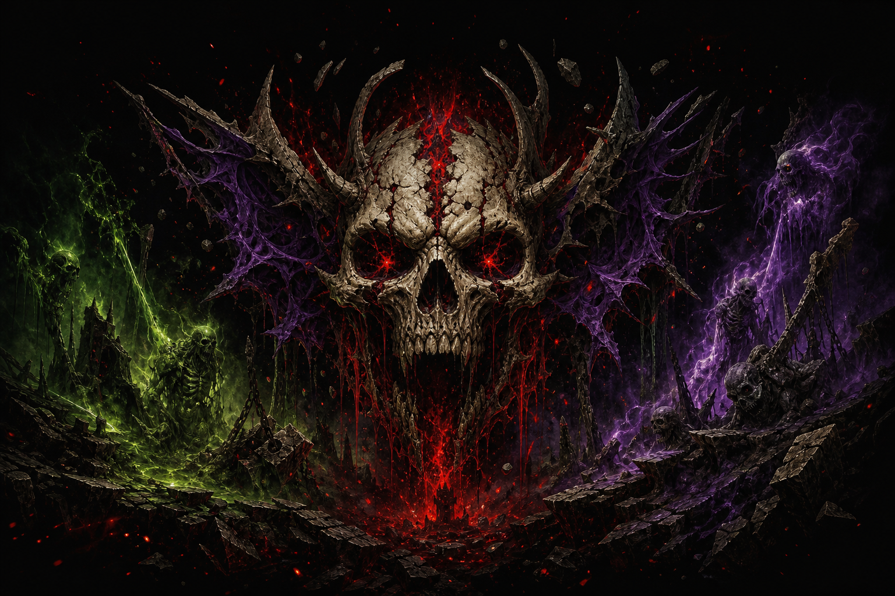

> A brutal dark theme forged in the void. Blood reds, bone whites, and decayed purples emerge from an abyss of pure black — as heavy as a breakdown.

**Type:** dark | **Palette:**     

### Dotonbori

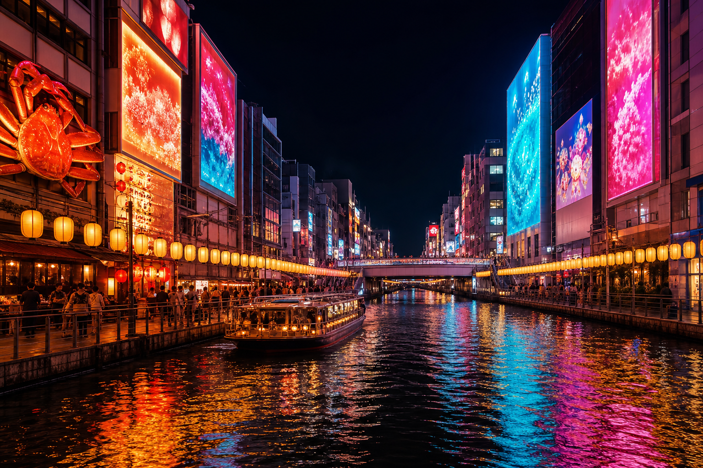

> Osaka's neon-lit canal district at night. Warm lantern golds, neon reds, and shimmering cyan reflections paint the darkness of the bustling entertainment quarter.

**Type:** dark | **Palette:**     

### Endfield

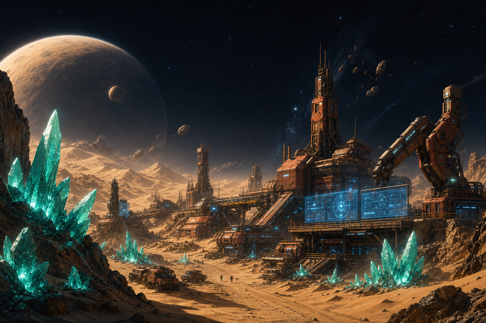

> A frontier-tech dark theme inspired by Arknights: Endfield. Talos-II's amber deserts, Endministrator blue interfaces, Originium teal crystals, and rust-toned industrial outposts against the void of deep space.

**Type:** dark | **Palette:**     

### KOKO 幸祜

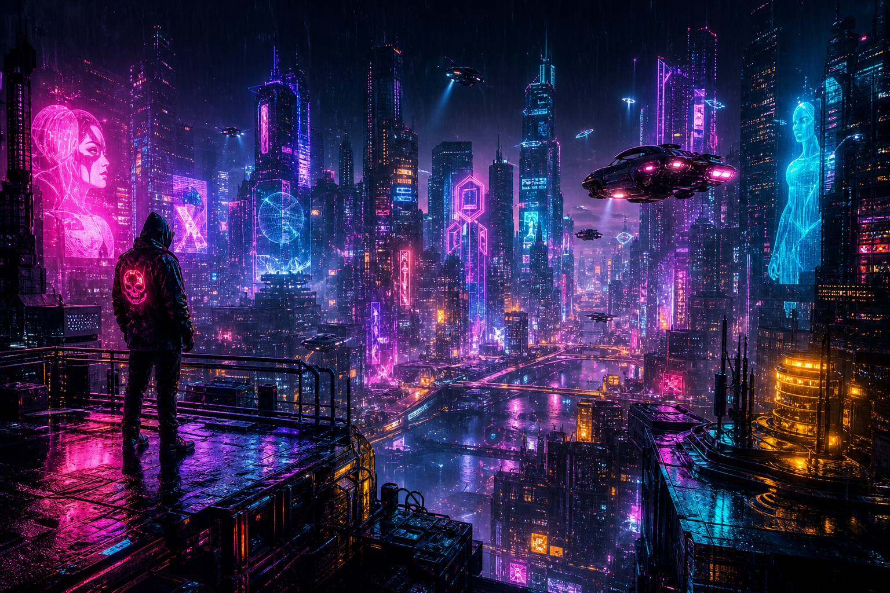

> A soft, dreamy dark theme inspired by gentle pastels and quiet elegance. Lavender pinks, mint greens, and warm golds float on a deep twilight canvas.

**Type:** dark | **Palette:**     

### Megaman Zero

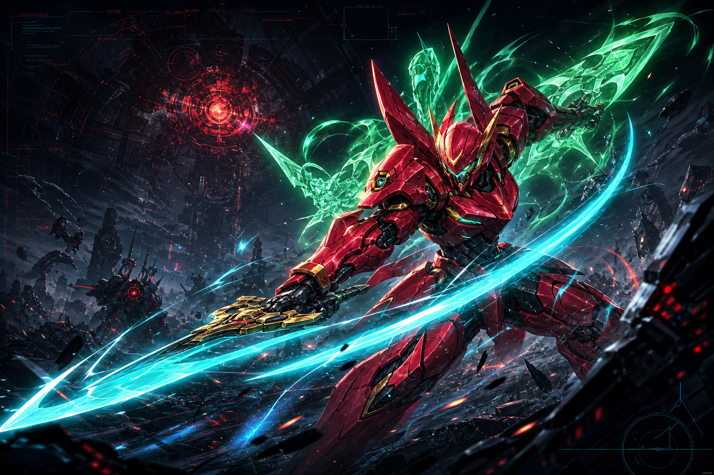

> A fierce dark theme inspired by the Mega Man Zero series. Zero's crimson armor, the cyan glow of the Z-Saber, golden hair, and Cyber-elf green pulse through a battle-scarred dystopian interface.

**Type:** dark | **Palette:**     

### Porco Rosso

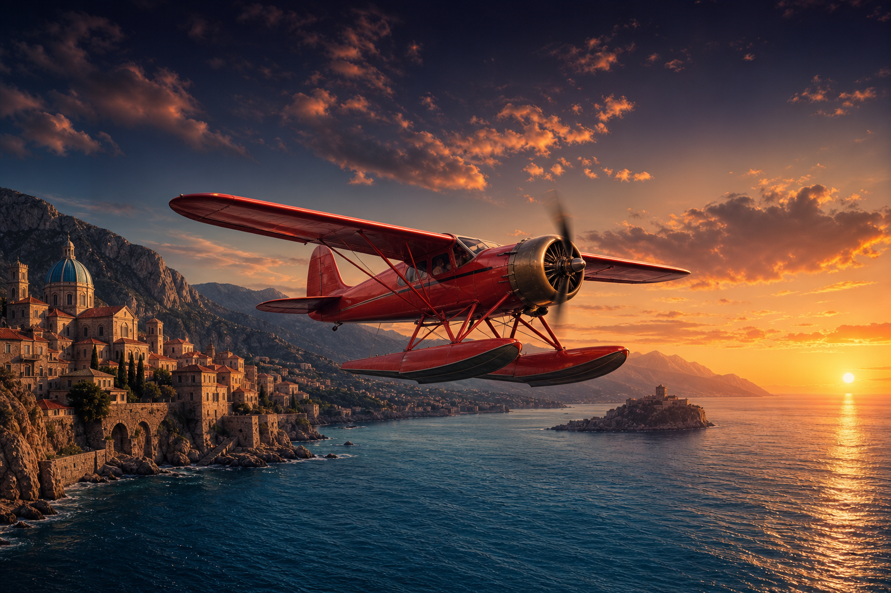

> A warm, cinematic dark theme inspired by the Adriatic skies and crimson seaplanes of Porco Rosso. Rich reds, Mediterranean blues, sunset golds, and weathered bronze tones evoke the romance of interwar aviation.

**Type:** dark | **Palette:**     

### World War I

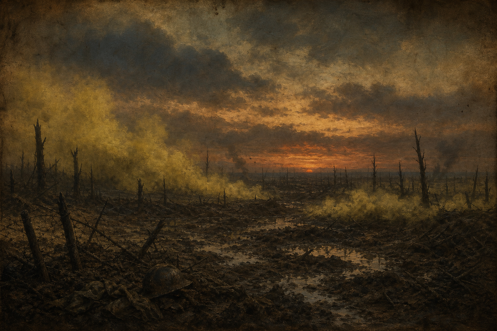

> A somber dark theme evoking the Great War era. Trench mud browns, mustard gas yellows, rusted iron, and aged parchment — the muted palette of no man's land.

**Type:** dark | **Palette:**     

## Setup

```bash
pnpm install
```

Requires the `code` CLI: in VSCode, press `Cmd+Shift+P` → "Shell Command: Install 'code' command in PATH".

## Commands

```bash
# Build all themes as individual .vsix files
pnpm build

# Build the unified .vsix (all themes in one extension)
pnpm build:unified

# Build + install (individual / unified)
pnpm install-themes
pnpm install-unified

# Uninstall (individual / unified)
pnpm uninstall-themes
pnpm uninstall-unified

# Regenerate this README
pnpm readme
```

## Adding a New Theme

Use the `/vscode-theme` skill in Claude Code. New themes under `themes/*` are discovered automatically by the build — no manual registration needed. Each theme's hero image, color-swatch palette, README, icon, and CHANGELOG are generated for you.
